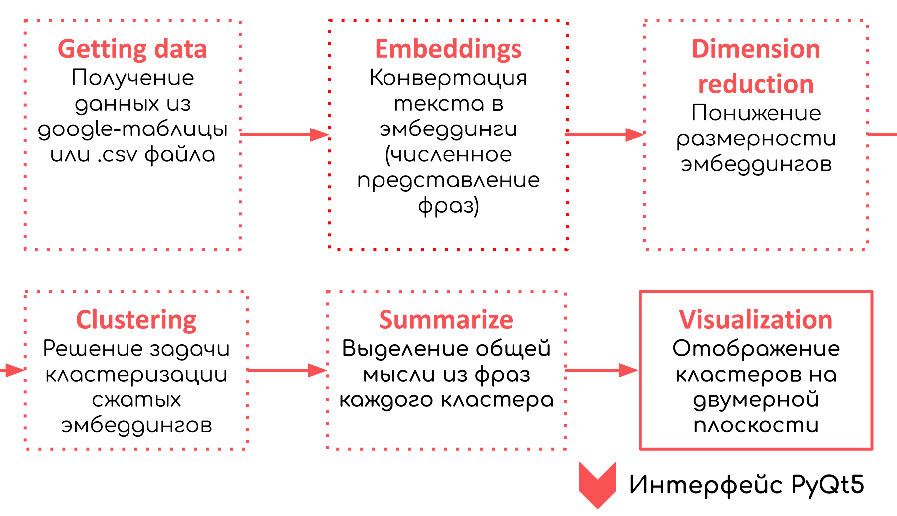
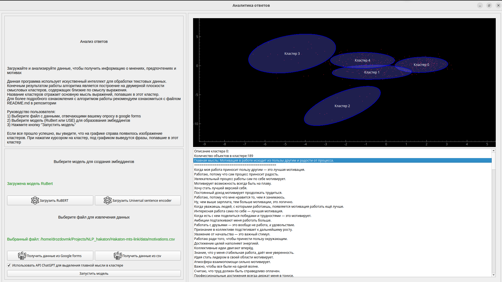
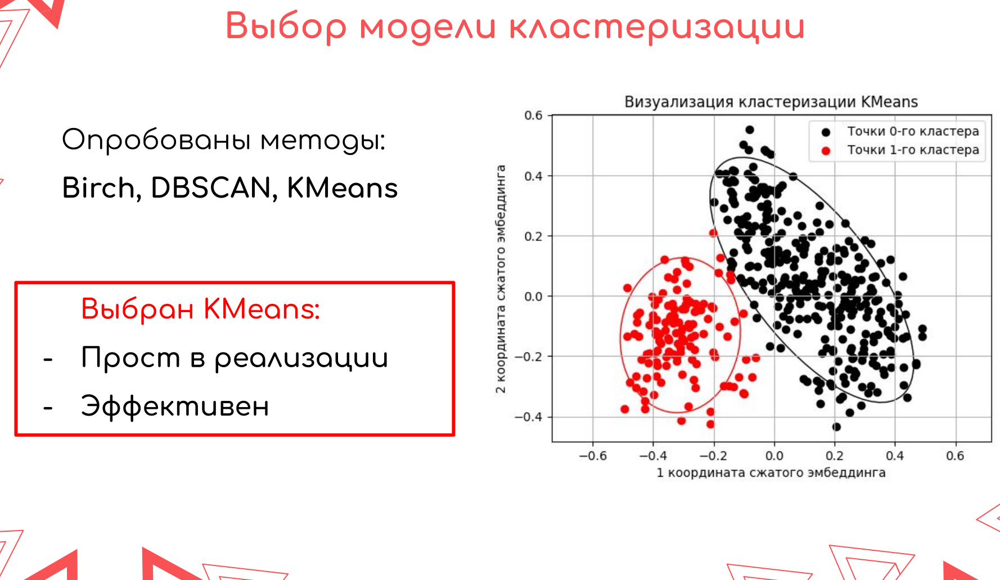
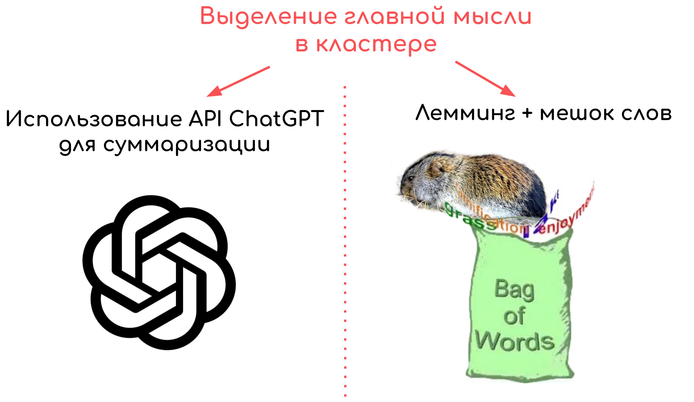

# Hakaton-mts-link



# Установка

0. Версия python 3.10.15

1. Клонирование репозитория 

```git clone https://github.com/DrozdovMK/Hakaton-mts-link.git```

2. Переход в директорию Hakaton-mts-link

```cd Hakaton-mts-link```

3. Создание виртуального окружения

```python3 -m venv venv```

4. Активация виртуального окружения

```source venv/bin/activate```

5. Установка зависимостей

```pip install -r requirements.txt```

6. Запускаем файл удобным ранером

```python inter.py```


# Документация

Приложение позволяет кластеризировать и визуализировать ответы пользователей на нужные вам вопросы.

На выходе пользователь получает отрисованные облака слов (кластеры ответов). Ответы по каждому кластеру можно посмотреть в отедльном окне, нажав на необходимый кластер.

При запуске приложения, вы сможете увидеть краткое руководство по использованию.

## Работа с приложением:

  1. Выберите файл с данными, отвечающий вашему запросу .csv файл или google-forms

  Желательная структура csv (.txt) файла: на каждой строке по одному ответу
  
  2. Выберите подходящую модель для образования эмбеддингов
  
  3. Нажмите кнопку запустить модель. После некоторого времени, в окне справа вы увидете построенные кластеры ответов.



# Ход решения

## Форма поступающих данных

Пользователю приложения на выбор предоставляется несколько способов подгрузки данных. 

Данные должны иметь формат csv, который содержит список ответов на задаваемый вопрос. Данный файл несложно получить из ответов googleforms. Взаимдействие напряму с google-forms напрямую также предусмотрен. Однако тогда необходимо создать папку keys в вашем локальном репозитории и скопировать туда файл google_key.json со информацией.

## Подгружаемые модели для извлечения эмбеддингов

Для извлечения эмбеддингов на выбор предоставляется две модели:
1) RuBERT [скачать](https://huggingface.co/DeepPavlov/rubert-base-cased)

RuBert - это нейронная сеть, основанная на архитектуре BERT (Bidirectional Encoder Representations from Transformers), адаптированная для русского языка. Она была создана для решения различных задач обработки естественного языка (NLP) на русском языке.  RuBERT обучалась на большом корпусе текстов, содержащем различные источники на русском языке. Это могли быть статьи, книги, новостные ленты и другие формы текста. Основная цель — обеспечить модель разнообразной и репрезентативной лингвистической информацией. Преимуществами RuBert является:

- Контекстуальность: Благодаря своей архитектуре, модель учитывает контекст слов в предложении, что позволяет лучше понимать смысл.
- Многофункциональность: Может быть адаптирована к различным задачам NLP, что делает её универсальным инструментом для работы с текстом на русском языке.

2) USE [скачать](https://www.tensorflow.org/hub/tutorials/semantic_similarity_with_tf_hub_universal_encoder)

Universal Sentence Encoder (USE) - это мощная модель глубокого обучения, разработанная Google, предназначенная для создания векторных представлений предложений, которые можно использовать для различных задач NLP. USE обучалась на большом количестве текстов из разных источников, включая веб-страницы, статьи, диалоги и другие материалы на разных языках. Это обеспечивает модели широкий лексический и семантический контекст. Преимуществами данной модели является:

- Скорость: Генерация векторов выше по сравнению с другими методами, что делает её подходящей для реальных приложений в реальном времени.

- Многоязычность: Модель была обучена на многоязычных данных, что позволяет ей создавать векторные представления для предложений на различных языках, включая русский, английский, испанский, французский, немецкий, китайский и многие другие.

## Кластеризация эмбеддингов

Перед рассмотрением задачи кластеризации и выбора подходящей модели, стоит сказать, что после получения эмбеддингов необходимо провести понижение размерности, так как решать задачу кластеризации в 750-мерном пространстве некорректно в силу разреженности данных и схожести расстояний между точками (проклятие размерности). Для понижения размерности использовался метод главных компонент. Далее под словом "эмбеддинги" подразумеваются уже сжатые эмбеддинги (в 2-мерном пространстве).

Выбор алгоритма кластеризации основывался на двух требованиях:

1) Чтобы алгоритм был надежным и простым в настройке 
2) Чтобы подходил для типичной структуры данных нашей задачи.

Просмотрев большое количество различных датасетов был сделан вывод о том, что смысловые кластеры имеют округлую форму или форму эллипсов. В этом случае стандартный алгоритм Kmeans является хорошим выбором для решения задачи кластеризации. В этом мы убедились еще раз при сравнении с другими алгоритмами.



Кластеризация эмбеддингов происходит за счет моделей кластеризации K-Means. Определение оптимального количества кластеров происходит за счет выбора наибольшего силуэтного коэффициента при переборе количества кластеров.

## Выделение общей мысли

Получив разделение по кластерам, мы предлагаем провести суммаризацию ответов - выделение главной информации, описывающей данный кластер. Сделать это можно двумя путями:



1) Отправить в ChatGPT запрос с промптом, который описывает задачу суммаризации текста, то есть нахождения общей фразы или мысли.Например: "Выдели мне коротко главную мысль этого набора фраз: (и перечислить фразы, принадлежащие кластеру)". Здесь стоит отправлять не всех представителей кластера, а наиболее ярких представителей, например тех, эмбеддинги которых находятся ближе всего к центру кластера. Для запросов можно использовать официальный API (например который предоставляет [Chad AI](https://ask.chadgpt.ru/)) или же бесплатный, но менее надежный API от [g4f](https://github.com/xtekky/gpt4free). 

При использовании официального API, необходимо в папке keys (если ее нет, то создать) создать файл chad_key.csv и скопировать туда свой ключ, который выдается на сайте [Chad AI](https://ask.chadgpt.ru/). При желании можно дописать свою логику суммаризации текста, для этого нужно в scripts/summarizer.py переопределить метод summarize класса gpt_summarizer.

2) Оффлайн-суммаризация. Если вы не хотите использовать API ChatGPT, то можно провести лемматизацию всех ответов (лемматизация это привод в стандартную форму из словаря, например бежать – бег, свечками - свеча) и просто вывести наиболее часто встречающиеся слова. При отсутствии сети или при отсутствии ответа на запрос ChatGPT (что часто бывает при использовании неоффициального API от g4f) используется оффлайн алгоритм.

## Визуализация

Для большей визуальной наглядности были отрисованы эллипсы, ограничивающие края каждого кластера. Направлению полуосей эллипса соответствуют собственные вектора матрицы Грамма. А значению полуосей - ее собственные числа.


Для визуализации алгоритма, мы предлагаем графический интерфейс, написанный на PyQt5. Ниже, на видео приведен пример использования графического интерфейса. Сами элементы интерфейса максимально понятны. Сам интерфейс содержит краткое руководство пользователя. Также реализована возможность обзора ответов, при нажатии на каждый из кластеров, в окне под графиком появляются фразы, принадлежащие соответствующему кластеру в порядке удаления от центра кластера.

https://github.com/user-attachments/assets/5dfe4d99-7d15-402f-822d-58b1ab433e5b


