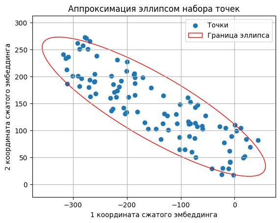

# Hakaton-mts-link


# Установка

0. Версия python 3.10.15

1. Клонирование репозитория 

```git clone https://github.com/DrozdovMK/Hakaton-mts-link.git```

2. Переход в директорию Hakaton-mts-link

```cd Hakaton-mts-link```

3. Создание виртуального окружения

```python3 -m venv venv```

4. Активация виртуального окружения

```source venv/bin/activate```

5. Установка зависимостей

```pip install -r requirements.txt```

6. Запускаем файл удобным ранером

```python inter.py```


# Документация

Приложение позволяет кластеризировать и визуализировать ответы пользователей на нужные вам вопросы.

На выходе пользователь получает отрисованные облака слов (кластеры ответов). Ответы по каждому кластеру можно посмотреть в отедльном окне, нажав на необходимый класетр.

При запуске приложения, вы сможете увидеть краткое руководство по использованию.

## Работа с приложением:

  1. Выберите файл с данными, отвечающий вашему запросу googleforms (csv)
  
  2. Выберите подходящую модель для образования эмбеддингов
  
  3. Нажмите кнопку запустить модель

(ФОТКА ПРИЛОЖЕНИЯ PYQT)

# Ход решения

## Форма поступающих данных

Пользователю приложения на выбор предоставляется несколько способов подгрузки данных (ответов на вопросы). 

Данные должны иметь формат csv, который содержит список ответов на задаваемый вопрос. Данный файл несложно получить из ответов googleforms.

## Подгружаемые модели для извлечения эмбеддингов

Для извлечения эмбеддингов на выбор предоставляется две модели:
  1. RuBERT [скачать](https://huggingface.co/DeepPavlov/rubert-base-cased)
  2. USE [скачать](https://huggingface.co/Dimitre/universal-sentence-encoder/tree)

(Вы можете загрузить свои версии даных моделей)

## Кластеризация эмбеддингов

Кластеризация эмбеддингов происходит за счет моделей кластеризации K-Means и DBSCAN. Выбор модели и количество кластеров происходит за счет выбора наибольшего силуэтного коэффициента из двух моделей.

## Нахождение общего слова

Каждый кластер имеет общую мысль или общее слово. Для нахождения общей мысли из каждего кластера в ChatGPT отправляется запрос с промптом, который описывает задачу суммаризации текста, то есть нахождения общей фразы или мысли. Для данного решения при наличии сети используется апи ChatGPT, однако в дальнейшем планируется переход на собственую модель. 

При отсутствии сети используется наивный подход. Выделение общей мысли происходит следующим путем:
  1. Производится лематизация текста
  2. Подсчитывается частота вхождения каждого слова в кластер при помощи Bag of Words


## Визуализация

Для понятной человеку визуализации был применени метод t-SNE, проецирование эмбедингов на двумерную плоскость.


Для отрисовки облаков слов были подсчитаны центры кластеров на двумерной плоскости, было подсчитано колличсетво эмбеддингов каждого класса, а также их концентрация для отрисовки эллиспа.  


Так же реализована возможность обзора ответов, при нажатии на каждый из кластеров, для проверки и понимания того, что скрывается за каждыс обобщающим кластер словом.

Приложение написанов при помощи фреймворка PyQT5 для удобной подкгрузки данных и понятной визуализации.


https://github.com/user-attachments/assets/5dfe4d99-7d15-402f-822d-58b1ab433e5b


